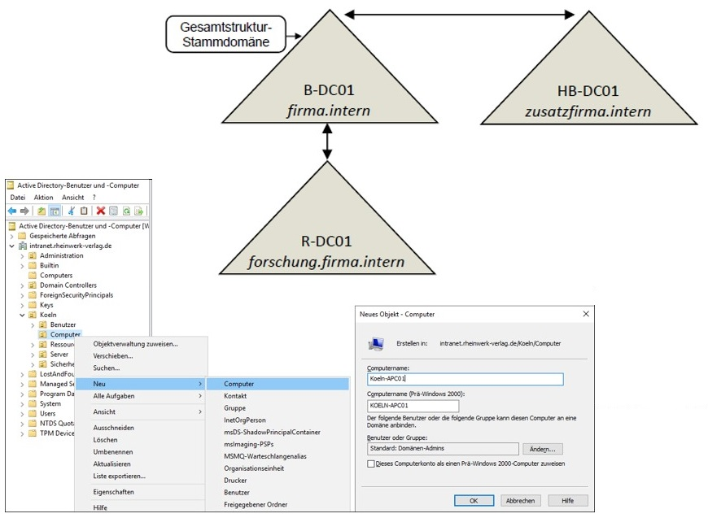

# Szenario
<!--LS10.1-Szenario-->

| Für eine Firma soll eine Active Directory Umgebung neu konzipiert und implementiert werden. Die Firma besteht aus mehreren Standorten. Den Benutzern soll ein eigener Arbeitsbereich zur Verfügung gestellt werden. Die Computer- und Benutzerkonfiguration soll zum aller größten Teil automatisch erfolgen. Die Benutzer möchten beim Wechsel ihrer Arbeitsstation ihre eigene Arbeitsumgebung beibehalten. Die Firma legt großen Wert auf weitere Skalierbarkeit und Absicherung der Daten vor unberechtigten internen Zugriff. |  |

<!--LS10.1-Szenario-->

## Material Unterricht
- [HERDT|Campus: Windows Server 2019 Aufbau und Verwaltung](https://herdt-campus.com/product/W2019AVN)
- [Rheinwerk : Windows Server 2012 R2 - Das umfassende Handbuch](https://openbook.rheinwerk-verlag.de/windows_server_2012r2/)

## Material (Weiterführend)
- [Windows Server-Dokumentation](https://learn.microsoft.com/de-de/windows-server/)
- [Microsoft Docs Lernpfad: Active Directory-Domänendienste (AD DS)](https://learn.microsoft.com/de-de/training/paths/active-directory-domain-services/)

- [Microsoft Docs Modul: Implementieren von Windows Server-DNS](https://learn.microsoft.com/de-de/training/modules/implement-windows-server-dns/)

- [Microsoft Docs Modul: Implementieren von Gruppenrichtlinienobjekten](https://learn.microsoft.com/de-de/training/modules/implement-group-policy-objects/)

- [Microsoft Docs Modul: Implementieren der IP-Adressverwaltung](https://learn.microsoft.com/de-de/training/modules/implement-ip-address-management/)

- [LinkedIn Learning Kurs: Windows Server 2019 Active Directory: Aufbau, Installation und Konfiguration](https://de.linkedin.com/learning/windows-server-2019-active-directory-aufbau-installation-und-konfiguration/active-directory-in-windows-server-2019-einrichten?autoplay=true&resume=false&u=68522354) 

- [Linked in Learning Windows Server 2019: DHCP and DNS](https://www.linkedin.com/learning/windows-server-2019-dhcp-and-dns/dhcp-and-dns-in-windows-server-2019?u=68522354)

## Installation und Konfiguration der Active Directory-Domänendienste

[A1_0 Zugriff auf die Cloud Infrastruktur](A1_0 Zugriff auf die Cloud Infrastruktur)