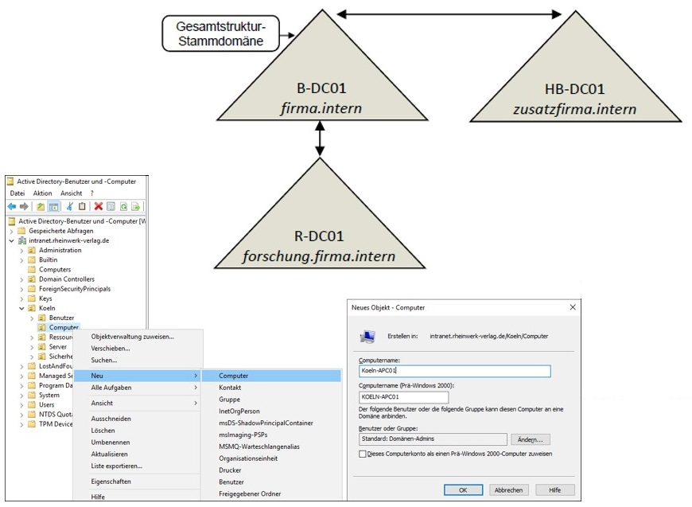

# Szenario

Für eine Firma soll eine Active Directory Umgebung neu konzipiert und implementiert 
werden. Die Firma besteht aus mehreren Standorten. Den Benutzern soll ein eigener 
Arbeitsbereich zur Verfügung gestellt werden.
Die Computer-  und Benutzerkonfiguration soll zum aller größten Teil automatisch
erfolgen. Die Benutzer möchten beim Wechsel ihrer Arbeitsstation ihre eigene
Arbeitsumgebung beibehalten.
Die Firma legt großen Wert auf weitere Skalierbarkeit und Absicherung der Daten vor 
unberechtigten internen Zugriff.