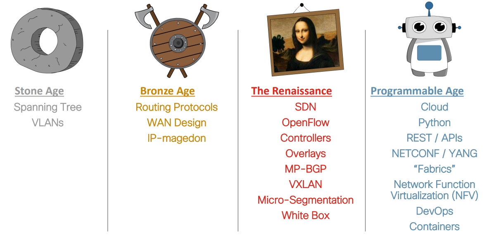

# Szenario

Ihr Arbeitgeber, die Change IT GmbH ist ein mittelständisches Unternehmen welches in den letzten Jahren stark expandiert hat. Dadurch ist das Netzwerk ebenfalls mit gewachsen und es ist mittlerweile zeitaufwändig alle Netzwerkgeräte manuell zu konfigurieren und zu überwachen. Die Suche nach Fehlern, die bei der manuellen Konfiguration immer wieder auftreten sind zeitaufwändig zu finden und kostspielig, da Ausfallzeiten des Netzwerks die Leistungsfähigkeit des Unternehmens beeinträchtigen. Aus diesem Grund wurden Sie beauftragt, sich mit dem Thema Netzwerkautomatisierung zu befassen. Ihre Erkenntnisse sollen anschließend in die Automatisierung des Unternehmensnetzwerks einfließen.