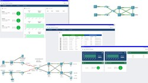

<!--LS10.2-Szenario-->
# Szenario

| Das Systemhaus ChangeIT wurde von einem Kunden beauftragt sich um das Thema Monitoring in seinem Netzwerk zu kümmern. Dabei sind verschiedene Aspekte zu berücksichtigen, für die der Kunde eigene Arbeitspakete definiert und beauftragt hat, die Sie nacheinander umsetzen sollen. Es geht dabei um die Themenbereiche Device Discovery, Zeit im Netzwerk, Logging, SNMP, Monitoring und Management per CLI und SDN, sowie das Monitoring per Script. |  |

<!--LS10.2-Szenario-->